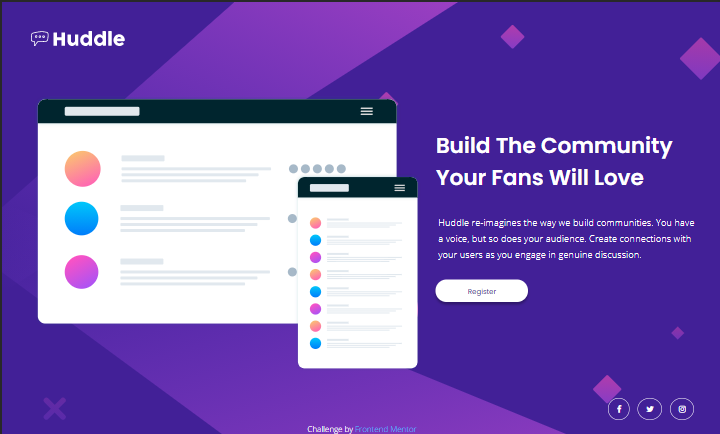

<h1 align="center">Huddle Landing Page</h1>

  <h3>
    <a href="https://huddle-landing-page-teal.vercel.app/">
      Live site
    </a>
     | 
    <a href="https://www.frontendmentor.io/solutions/huddle-landing-page-mobile-first-gSfSkDyem">
      Solution
    </a>
     | 
    <a href="https://www.frontendmentor.io/challenges/huddle-landing-page-with-a-single-introductory-section-B_2Wvxgi0">
      Challenge
    </a>
  </h3>

   Solution for a challenge from <a href="https://www.frontendmentor.io/" target="_blank">Frontendmentor.io</a>

---

## Table of contents

- [Overview](#overview)
  - [Built with](#built-with)
- [Contact](#contact)

<!-- Overview section -->
## Overview

- Frontend Mentor challenges help you improve your coding skills by building realistic projects. 

- You can see a live site at [Huddle landing page](https://huddle-landing-page-teal.vercel.app/)

### Built with 

- Semantic HTML5 markup
- CSS custom properties
- SCSS
- Flexbox
- Mobile-first workflow

<!-- Contact section -->

##  Contact

- Github Repositories [@Aman-sgz](https://github.com/Aman-sgz/)

- Frontend Mentor [@Aman-sgz](https://www.frontendmentor.io/profile/Aman-sgz)

- Twitter Aman [@Aman_arg](https://www.twitter.com/Aman-arg_)  

---

    
Aman-sgz | 2020

